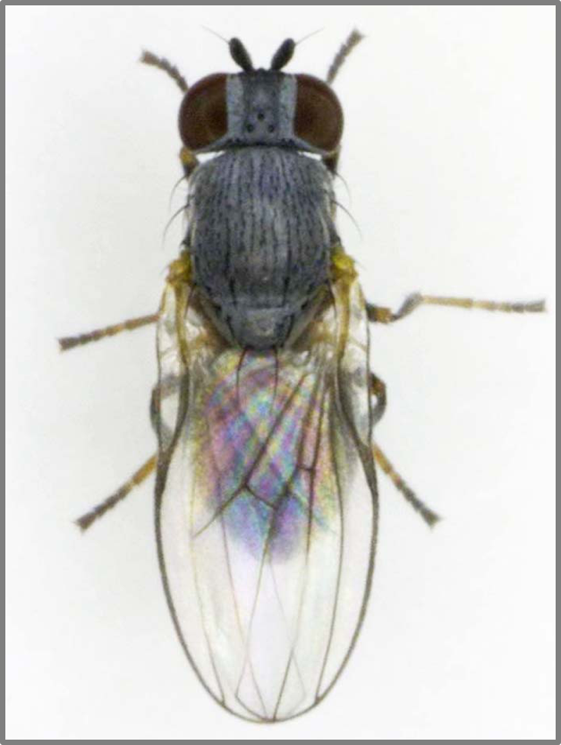

```{r setup, include=FALSE}
knitr::opts_chunk$set(echo = FALSE)
```
## Introduction


##
\begin{picture}(280,280)
\put(00,100){\includegraphics[height=18cm]{Hemlock forest 2 copy.png}}
\put(60,140){\begin{minipage}[t]{1\linewidth} 
{How will we save the Hemlocks?}
\end{minipage}}
\end{picture}

## Introduction
Silver Fly, *Leucopis* spp.

> - Success in other countries
> - Targets \color{red} both parts \color{black} of HWA lifecycle

\begin{picture}(250,250)
\put(10,130){\includegraphics[height=4cm]{SilverFlyPic.png}}
\put(120,130){\includegraphics[height=4cm]{HWA lifecycle.png}}
\end{picture}

## Introduction
**HWA Spread in the Eastern United States** 
\begin{picture}(250,250)
\put(50,130){\includegraphics[height=4cm]{HWA US Map.png}}
\put(5,110){\begin{minipage}[t]{1\linewidth} 
{Fig 1 (Havill et al. 2014): Biological control efforts have merited attention due to their host specificity, ability to lower and target HWA during multiple parts of its lifecycle, scalability, long-term potential to establish, and minimal impact on hemlock mortality$^5$.}
\end{minipage}}
\end{picture}

##Study Objectives
- __Objective 1:__ Determine the relationship between temperature and the development and fecundity of *Leucopis* spp. on east coast HWA.

- __Objective 2:__ Analyze the effects of co-habitation of Laricobius nigrinus and Leucopis spp. for possible negative interactions. 

- __Objective 3:__ Assess the establishment, phenology, survival, and fecundity of the PNW Leucopis spp. in a full tree enclosure.


