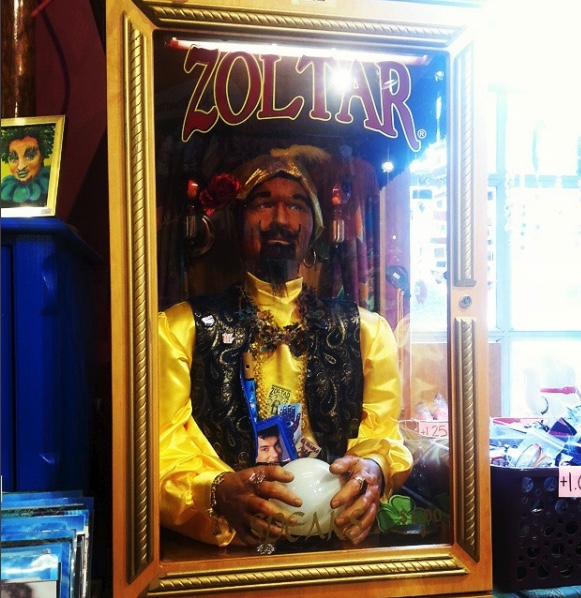

Contact: aneiderm@uvm.edu

* [RMarkdown Cheatsheet](https://www.rstudio.com/wp-content/uploads/2015/02/rmarkdown-cheatsheet.pdf) 

###Homework
* [HW Wk 2: Biocontrol Diagram and Silver Fly Diagram](Graphs_for_wk_2.html)

* [HW Wk 3: Beamer Preesentation: Determining the Phenology of Silver Fly (Leucopis spp.) on Hemlock Woolly Adelgid (Adelges tsugae) in the Eastern US](PractivePresentation.pdf)
